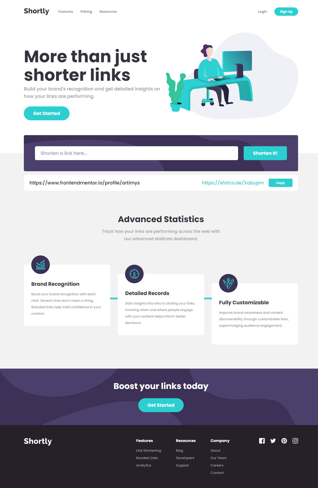

# Frontend Mentor - Shortly URL shortening API Challenge solution

This is a solution to the [Shortly URL shortening API Challenge challenge on Frontend Mentor](https://www.frontendmentor.io/challenges/url-shortening-api-landing-page-2ce3ob-G). Frontend Mentor challenges help you improve your coding skills by building realistic projects.

## Table of contents

- [Overview](#overview)
  - [The challenge](#the-challenge)
  - [Screenshot](#screenshot)
  - [Links](#links)
- [My process](#my-process)
  - [Built with](#built-with)
  - [What I learned](#what-i-learned)
  - [Useful resources](#useful-resources)
- [Author](#author)
- [Acknowledgments](#acknowledgments)

## Overview

### The challenge

Users should be able to:

- View the optimal layout for the site depending on their device's screen size
- Shorten any valid URL
- See a list of their shortened links, even after refreshing the browser
- Copy the shortened link to their clipboard in a single click
- Receive an error message when the `form` is submitted if:
  - The `input` field is empty

### Screenshot

### Links

- Solution URL: [https://github.com/artimys/url-shortening-api](https://github.com/artimys/url-shortening-api)
- Live Site URL: [https://artimys-url-shortening-api.netlify.app/](https://artimys-url-shortening-api.netlify.app/)

## My process

### Built with

- [React](https://react.dev/)
- [Tailwind CSS](https://tailwindcss.com/)
- [Formik](https://formik.org/) - React Forms
- [Yup](https://github.com/jquense/yup) - Form Validation
- [Clipboard API](https://developer.mozilla.org/en-US/docs/Web/API/Clipboard_API)

### What I learned

#### - Tailwind CSS

This was my first project using Tailwind CSS. It was definitely a learning curve but I got some much out of it. Project took longer to develop as I had to take breaks and research how to do things in Tailwind.

For instance,

- customizing the default theme (colors, fonts, page breakpoints)
- how to hover from parent to child element (`group` and `group-hover` classes)
- how to change the state of a sibling element (`peer` class and `peer-*` modifiers)
- where should base styles for `h1`, `a`, `body`, etc. go (@layer base)
- how to bundle some Tailwind classes to re-use (use `@apply` when declaring a new class)

#### - Formik and Yup

Great combo for creating React forms (Formik) and Yup for validation. It helped create a lean and consistent way of handling state and validation.

#### - Clipboard API

Never heard of the [Clipboard API](https://developer.mozilla.org/en-US/docs/Web/API/Clipboard_API) until Googling how to copy to clipboard. A nice find.

### Useful resources

- [The Net Ninja - Tailwind CSS YouTube Playlist](https://www.youtube.com/playlist?list=PL4cUxeGkcC9gpXORlEHjc5bgnIi5HEGhw) - A list of videos that helped me get started with Tailwind CSS
- [Tailwind CSS Docs](https://tailwindcss.com/docs/installation) - Constantly hitting up the official Tailwind CSS documentation. It helped me figure out what class names where available and how to use them.
- [Tailwind CSS Cheat Sheet](https://nerdcave.com/tailwind-cheat-sheet) - A cheat sheet for Tailwind CSS. Found out about this after but could be useful for future projects.
- [Formik Tutorial with Yup Validation](https://www.youtube.com/watch?v=7Ophfq0lEAY&t=4s) - Great tutorial on how to get started with the libraries

## Author

- Frontend Mentor - [@artimys](https://www.frontendmentor.io/profile/artimys)

## Acknowledgments
